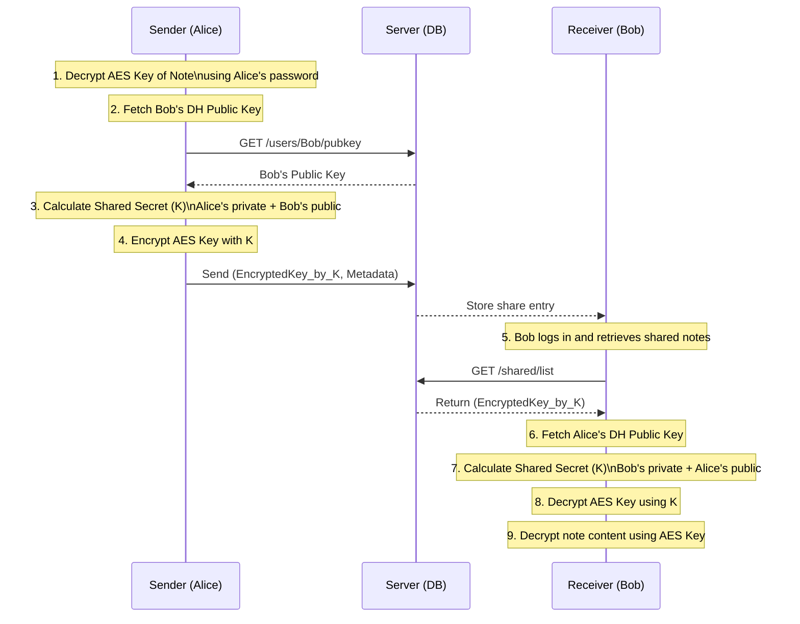

# 🔐 Secure Note Sharing Application (E2EE)

A high-security note and file sharing system built with a Client-Server architecture, End-to-End Encryption (E2EE), and Diffie-Hellman key exchange. The server stores encrypted data only (Zero-Knowledge Architecture). All encryption and decryption happen exclusively on the client side.

---

## 📖 Introduction

This project is a secure file/note sharing system where the server **never** sees the real content of any note. Clients encrypt data locally before sending it, and decrypt data locally after receiving it.

Sharing access between users is performed using **Diffie-Hellman Key Exchange**, ensuring that no decryption key is ever transmitted in plaintext.

---

## 🚀 Key Features

### 🔒 Hybrid Encryption

* AES-256-GCM: Encrypts note content
* RSA-OAEP: Protects the AES key when needed

### 🔑 Secure Sharing

* Diffie-Hellman exchange allows two users to derive a shared secret
* AES key of the note is encrypted with this shared secret
* No private key ever leaves the client

### 💥 Self-Destruct Notes

* Notes can have TTL (expiry time)
* Notes can limit number of accesses (max views)

### 🖥️ Powerful CLI Client

* Easy-to-use command-line interface
* Session management included

### 🧍‍♂️ User Protection

* User private keys are encrypted with user passwords
* Server cannot decrypt or read any private key

---

## 🛠️ Security Architecture

### 🔁 Sharing Model (Diffie-Hellman Flow)



---

## ⚙️ Setup & Run

### 🧰 Prerequisites

* Go 1.20+
* Docker (for MongoDB)

---

## 1️⃣ Start MongoDB with Docker

```bash
docker run -d -p 27017:27017 --name mongodb mongo:latest
```

---

## 2️⃣ Configure the Server

Create a `.env` file in the project root:

```
# Server Config
SERVER_PORT=8080
GIN_MODE=debug

# Database Config
MONGO_URI=mongodb://localhost:27017
DB_NAME=NoteAppDB

# Security
JWT_SECRET=super_secret_key_change_me
```

---

## 3️⃣ Start the Server

```bash
cd server
go mod tidy
go run main.go
```

Server will run at:

```
http://localhost:8080
```

---

# 💻 Client CLI Usage

Open a second terminal for the client.

---

## 🔐 1. Register & Login

```bash
# Register
go run main.go register -u <username> -p <password>

# Login (stores session)
go run main.go login -u <username> -p <password>
```

---

## 📁 2. Manage Personal Files

```bash
# Upload a file (encrypted locally before sending)
go run main.go save -f "C:\\path\\to\\secret.txt" -u <username>

# List owned files
go run main.go listOwnedFile -u <username>

# Delete a file permanently
go run main.go deleteFile -id <note_id> -u <username>
```

---

## 🔑 3. Secure Sharing (VIP Feature 🌟)

```bash
# Share file securely
go run main.go send -note <note_id> -t <receiver> -exp <expiry> -max <views> -u <sender>

# Example:
go run main.go send -note "6571ab..." -t "bob" -exp "2h" -max 5 -u "alice"
```

* `-exp`: Expiry (e.g., 1h, 30m, 24h)
* `-max`: Max number of views (e.g., 1 = one-time view)

---

## 👁️ 4. Receiver Views Shared Files

```bash
go run main.go listSharedFile -u <receiver>
```

---

# 📂 Project Structure

```
.
├── server/                 # Backend (Go + Gin)
│   ├── configs/            # DB connection
│   ├── handlers/           # HTTP request handlers
│   ├── middlewares/        # Auth & validation
│   ├── models/             # MongoDB models
│   ├── routers/            # API routes
│   ├── services/           # Business logic
│   ├── utils/              # RSA, hashing, crypto utils
│   └── main.go
│
├── client/                 # CLI Client (Go)
│   ├── crypto/             # AES, RSA, DH algorithms
│   ├── services/           # Server API calls
│   ├── models/             # Data structures
│   └── main.go
│
├── tests/                  # Integration tests
├── .env                    # Environment config
├── go.mod                  # Dependencies
└── README.md               # Documentation
```

---

# 🛡️ Technologies Used

* **Language:** Go (Golang)
* **Framework:** Gin-Gonic
* **Database:** MongoDB
* **Cryptography:**

  * AES-GCM (crypto/aes)
  * RSA-OAEP (crypto/rsa)
  * Diffie-Hellman (math/big)
  * PBKDF2 (x/crypto/pbkdf2)

---

# 👨‍💻 Authors

Developed by Group 4 — Introduction to Encryption & Decryption:

* **Trần Nguyễn Trí Thanh**
* **Trương Thanh Thuận**
* **Lê Nguyễn Quốc Thái**
* **Nguyễn An Trí**

---

# ⭐ Support the Project

If you find this project interesting or useful, please consider giving it a **Star ⭐ on GitHub!**
